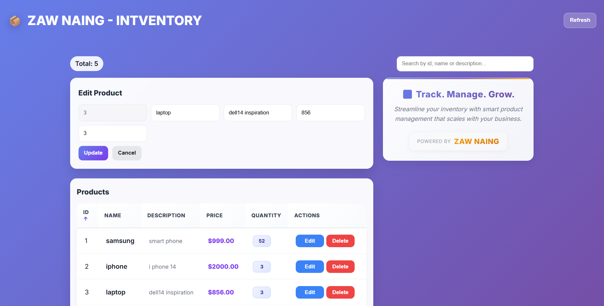

# 📦 Product Inventory Management System

A full-stack inventory management application built with **FastAPI**, **PostgreSQL**, and **React**. It supports full CRUD operations on products, with a clean, responsive UI featuring live search, column sorting, and inline editing.


---

## ✨ Features

- **Full CRUD** — create, read, update, and delete products
- **Live search** — filter products instantly by ID, name, or description
- **Sortable columns** — click any column header to sort ascending/descending
- **Auto-dismissing alerts** — success/error toasts that clear themselves
- **Responsive UI** — adapts cleanly from desktop to mobile
- **Auto-seeded database** — sample products load automatically on first run
- **CORS-configured API** — ready to talk to a separate frontend origin

---

## 🛠️ Tech Stack

**Backend**
- [FastAPI](https://fastapi.tiangolo.com/) — REST API framework
- [SQLAlchemy](https://www.sqlalchemy.org/) — ORM
- [Pydantic](https://docs.pydantic.dev/) — request/response validation
- [PostgreSQL](https://www.postgresql.org/) — relational database

**Frontend**
- [React](https://react.dev/) (functional components + hooks)
- [Axios](https://axios-http.com/) — HTTP client
- Custom CSS (no UI framework)

---

## 📁 Project Structure

```
├── backend/
│   ├── main.py              # FastAPI app & route definitions
│   ├── models.py            # Pydantic schemas
│   ├── database_model.py    # SQLAlchemy ORM models
│   └── database.py          # DB engine & session config
│
└── frontend/
    ├── src/
    │   ├── App.js            # Main application component
    │   ├── App.css
    │   ├── TaglineSection.js # Branding/tagline component
    │   ├── TaglineSection.css
    │   ├── index.js
    │   └── index.css
    └── package.json
```

---

## 🚀 Getting Started

### Prerequisites

- Python 3.10+
- Node.js 16+
- PostgreSQL running locally (or a hosted instance)

### 1. Clone the repository

```bash
git clone https://github.com/<your-username>/<your-repo>.git
cd <your-repo>
```

### 2. Backend setup

```bash
cd backend
python -m venv venv
source venv/bin/activate    # On Windows: venv\Scripts\activate

pip install fastapi uvicorn sqlalchemy psycopg2-binary pydantic python-dotenv
```

Create a `.env` file in the `backend/` directory:

```env
DATABASE_URL=postgresql://<user>:<password>@localhost:5432/<db_name>
```

> ⚠️ **Note:** Database credentials should never be committed to source control. Load them via environment variables (e.g. with `python-dotenv`) rather than hardcoding them in `database.py`.

Run the API:

```bash
uvicorn main:app --reload
```

The API will be available at `http://localhost:8000`, with interactive docs at `http://localhost:8000/docs`.

### 3. Frontend setup

```bash
cd frontend
npm install
npm start
```

The app will be available at `http://localhost:3000`.

---

## 🔌 API Endpoints

| Method | Endpoint          | Description              |
|--------|-------------------|---------------------------|
| GET    | `/`                | Health check / welcome   |
| GET    | `/products`        | Fetch all products       |
| GET    | `/products/{id}`   | Fetch a single product   |
| POST   | `/products`        | Create a new product     |
| PUT    | `/products/{id}`   | Update an existing product |
| DELETE | `/products/{id}`   | Delete a product         |

**Example product object:**

```json
{
  "id": 1,
  "name": "Samsung Galaxy",
  "description": "Smart phone",
  "price": 999.0,
  "quantity": 5
}
```

---

## 🖥️ Screenshots

_Add screenshots or a short demo GIF of the app here to make the repo more compelling for recruiters._

```

```

---

## 🗺️ Roadmap / Possible Improvements

- [ ] Add pagination for large product lists
- [ ] Add authentication (JWT) for admin actions
- [ ] Move secrets to environment variables / secrets manager
- [ ] Add unit and integration tests (pytest, React Testing Library)
- [ ] Dockerize backend + frontend for one-command setup
- [ ] Add input validation feedback in the form UI

---

## 📄 License

This project is licensed under the [MIT License](LICENSE).

---

## 👤 Author

**Zaw Naing**

Feel free to connect or reach out with feedback!
